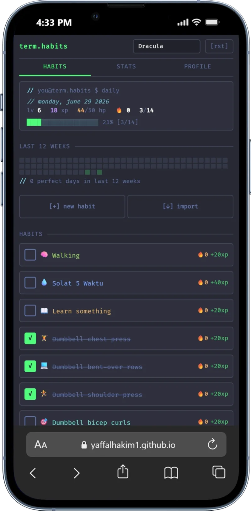
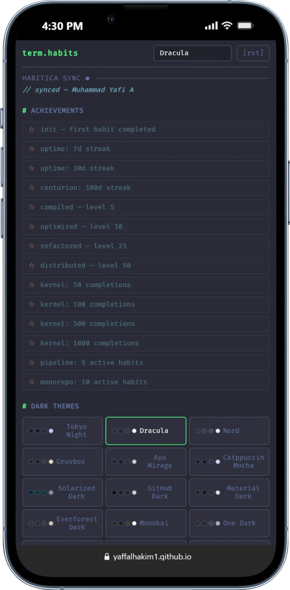

<p align="center">
  
</p>

<h1 align="center">$ term.habits</h1>

<p align="center">
  <i>// terminal habit tracker with RPG leveling</i>
</p>

<p align="center">
  <a href="https://yaffalhakim1.github.io/habit-terminal/">Live Demo</a> · No account needed · Works offline · PWA
</p>

---

<p align="center">
  
  
</p>

A monospace, terminal-themed habit tracker with gamified RPG progression. Build habits, track streaks, level up your character — all in a dark, minimal interface.

## Features

- **RPG leveling** — Earn XP from habits, level up, lose HP for missed days
- **Streaks** — Track consecutive completions, earn fire badges
- **Heatmap** — GitHub-style 12-week activity grid
- **Edit habits** — Tap any habit to edit name, icon, color, schedule
- **15 themes** — Nothing Orange, Tokyo Night, Dracula, Nord, Gruvbox, Catppuccin Mocha, and more
- **Habitica sync** — Two-way sync with Habitica: import tasks, pull stats, auto-score on toggle
- **AI reflection** — BYOK weekly report: grades, progress bars, suggestions (MiMo / OpenAI / Gemini)
- **PWA** — Install on your phone, works offline
- **No account** — All data stays in your browser (localStorage)

## Integrations

### Habitica

Connect your Habitica account (User ID + API Key from Settings → API):

- **Import** — Pull all your habits + dailies with history into term.habits
- **Two-way sync** — Toggle a habit locally → auto-scores on Habitica
- **Stats sync** — Your real level, XP, and HP from Habitica appear in the app

### AI Reflection (BYOK)

Bring your own API key for AI-powered weekly reports:

- **Supported providers** — Xiaomi MiMo, OpenAI, Google Gemini
- **Terminal-style output** — Habit grades (A-F), progress bars, `[INFO]`/`[WARN]`/`[CRITICAL]` tags
- **Optional** — App works fully without an AI key

## Tech Stack

- React 19 + TypeScript
- Vite
- TanStack React Query
- CSS custom properties with `clamp()` (no framework)
- localStorage persistence
- Habitica API v3

## Privacy

**Your keys never leave your browser.** API keys (Habitica, AI providers) are stored in `localStorage` only — they are never sent to any server, never logged, never included in the codebase. The app runs 100% client-side. No backend, no analytics, no tracking.

## Getting Started

```bash
npm install
npm run dev
```

## Deploy

Push to `master` — GitHub Actions auto-deploys to GitHub Pages.

## License

MIT
