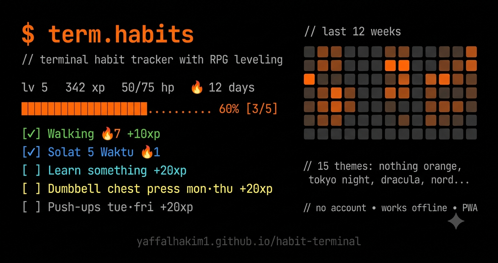

<p align="center">
  
</p>

<h1 align="center">$ term.habits</h1>

<p align="center">
  <i>// terminal habit tracker with RPG leveling</i>
</p>

<p align="center">
  <a href="https://yaffalhakim1.github.io/habit-terminal/">Live Demo</a> · No account needed · Works offline · PWA
</p>

---

A monospace, terminal-themed habit tracker with gamified RPG progression. Build habits, track streaks, level up your character — all in a dark, minimal interface.

## Features

- **15 themes** — Nothing Orange, Tokyo Night, Dracula, Nord, Gruvbox, Catppuccin Mocha, and more
- **RPG leveling** — Earn XP from habits, level up, lose HP for missed days
- **Streaks** — Track consecutive completions, earn fire badges
- **Heatmap** — GitHub-style 12-week activity grid
- **Edit habits** — Tap any habit to edit name, icon, color, schedule
- **PWA** — Install on your phone, works offline
- **No account** — All data stays in your browser (localStorage)

## Tech Stack

- React 19 + TypeScript
- Vite
- CSS custom properties (no framework)
- localStorage persistence

## Getting Started

```bash
npm install
npm run dev
```

## Deploy

Push to `master` — GitHub Actions auto-deploys to GitHub Pages.

## License

MIT
